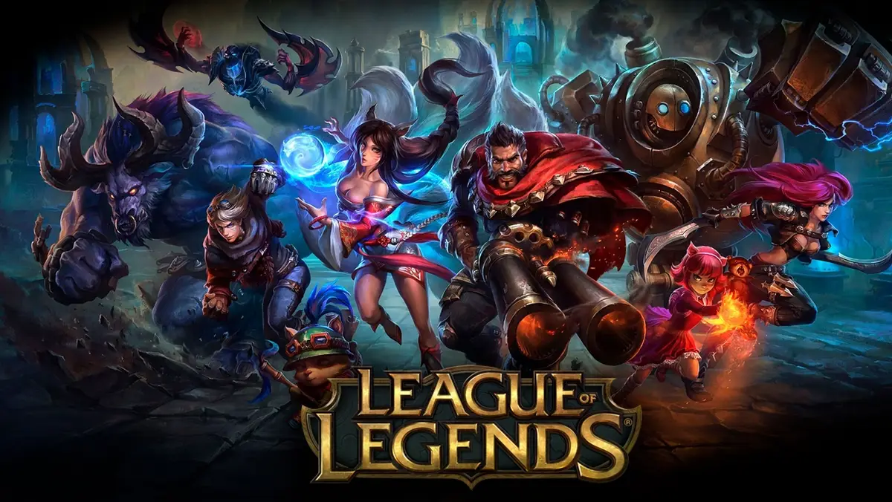

# League of Legends: Towers vs Kills Win Rate Statistical Analysis
This is a project for DSC 80 at UCSD.
Author:  Hsin Yu Ho (hyho@ucsd.edu)

    

---
## Introduction

League of Legends (LoL) is a multiplayer online battle arena (MOBA) game developed by Riot Games. There are more than 150 million players playing this game, which is one of the world’s most popular esports.

The project uses 2022 League of Legends esports match dataset from Oracle’s Elixir. This dataset contains a series of key game statistics and results from League of Legends matches, providing insights into which factors, champion pairings, tactics, or other factors can lead to victory. It includes various features such as banned/ picked champions, in-game statistics, and so on. 

In League of Legends, teams win by destroying the enemy Nexus. To reach the Nexus, teams must first destroy defensive structures such as turrets and inhibitors across the map. Because turrets provide map control and protect important objectives, teams that destroy more turrets often gain significant strategic advantages. This project investigates how objective control, especially turret destruction, relates to winning professional League of Legends matches.

The dataset contains team-level match statistics, including variables such as towers destroyed, kills, dragons, barons, gold differences, and match results. The project is interested in:

**Does destroying more towers significantly increase a team's probability of winning a professional League of Legends match?**

---

## Data Cleaning and Exploratory Data Analysis

The original dataset contains detailed information about professional League of Legends matches. To focus on team-level analysis, I selected observations corresponding to teams rather than individual players. I also restricted the dataset to complete matches and retained columns relevant to my research question.

Several cleaning steps:

* Filtered the dataset to include only team-level observations.
* Removed irrelevant columns that were not useful for analysis.
* Selected variables related to objectives and match outcomes.
* Investigated missing values and their patterns.

To predict what features help a team win a professional League of Legends match, I used several in-game statistics that capture objective control, combat performance, and economic advantage.
After filtering the dataset to team-level observations, I selected a subset of columns relevant to match outcomes and team performance:

* `gameid`: Unique identifier for each match.
* `side`: A team is on the Blue Side or Red Side.
* `result`: Match outcome. `1`: win and `0`: loss.
* `teamkills`: Total number of kills by the team.
* `teamdeaths`: Total number of deaths by the team.
* `towers`: Number of enemy towers destroyed by the team.
* `opp_towers`: Number of towers destroyed by the opposing team.
* `dragons`: Number of dragons secured by the team.
* `barons`: Number of barons secured by the team.
* `golddiffat25`: Gold difference between the team and its opponent at 25 minutes.
* `xpdiffat25`: Experience difference between the team and its opponent at 25 minutes.
* `csdiffat25`: Creep score (CS) difference between the team and its opponent at 25 minutes.

Below is cleaned lol_team dataframe:
<iframe
    src="assets/cleaned_df.html"
    width="100%"
    height="300">
</iframe>

 These variables were chosen because they capture key aspects of team performance, including combat success (`teamkills`, `teamdeaths`), objective control (`towers`, `dragons`, `barons`), and economic advantages (`golddiffat25`, `xpdiffat25`, `csdiffat25`). These factors are important indicators of a team's win rate.

### Univariate Analysis

One important variable is the number of towers destroyed by a team. The boxplot shows that most of the teams destroyed 3 ~ 9 towers. 
<iframe
    src="assets/towers_histogram.html"
    width="100%"
    height="600"
    frameborder="0">
</iframe>

The other important variable is the number of kills secured by a team. The boxplot shows that most of the teams had 8 ~ 20 s in a match. 
<iframe
    src="assets/kills_histogram.html"
    width="100%"
    height="600"
    frameborder="0">
</iframe>

### Bivariate Analysis

To explore the relationship between tower destruction and match outcomes, I created a boxplot comparing towers destroyed for winning and losing teams.

The visualization shows that winning teams consistently destroy more towers and had more kills than losing teams. This pattern suggests a strong association between objective control and match success.

We can see that the loss teams destroyed less towers than winning teams; winning teams generally destroyed more towers than losing teams.
<iframe
    src="assets/towers_boxplot.html"
    width="100%"
    height="600"
    frameborder="0">
</iframe>

We can see that the loss teams had less number of kills than winning teams; winning teams generally had more  number of kills.
<iframe
    src="assets/kills_boxplot.html"
    width="100%"
    height="600"
    frameborder="0">
</iframe>

### Interesting Aggregates

Grouping by match result reveals substantial differences in objective control.

<iframe
    src="assets/pivot.html"
    width="100%"
    height="300">
</iframe>

The winning team destroyed a larger number of towers on average, which initially proves that tower control is an important factor in determining the outcome of the game.

---

## Assessment of Missingness

One potentially NMAR (Not Missing At Random) variable is `url` column because it may depend on the missing values themselves or on information that is not observed in the dataset. Since this dependency cannot be verified directly using the available data, the missingness mechanism may be NMAR.

To investigate missingness, I conducted permutation tests comparing observed and missing groups using relevant variables. The results suggested that missingness was not strongly associated with key predictors used in this analysis, indicating that the missingness mechanism is unlikely to substantially bias the results.

Several variables in the dataset contain missing values. I investigated the missingness of `assistsat25`.

### Missingness Dependency on `datacompleteness`

To determine whether the missingness of `assistsat25` depends on another observed variable, I compared missingness across different values of `datacompleteness`.

- **Null Hypothesis**: The missingness of `assistsat25` does not depend on `datacompleteness`.

- **Alternative Hypothesis**: The missingness of `assistsat25` does depend on `datacompleteness`.

<iframe
    src="assets/missingness_assistsat25_DataComplete.html"
    width="100%"
    height="600"
    frameborder="0">
</iframe>

The permutation test produced a p-value which is **extremely small and close to 0**.
Since the p-value was **less than** 0.05, I **rejected** the null hypothesis. This indicates that the observed TVD is very unlikely to occur under the null hypothesis. Therefore, there is strong evidence that the missingness of `assistsat25` depends on `datacompleteness`.

### Missingness Dependency on `side`

I also investigated whether the missingness of `assistsat25` depends on a team's `side` selection.

Because a team's side (Blue/Red) should not directly influence whether `assistsat25` is recorded, I expected the missingness to be independent of `side`.

**Null Hypothesis**: The missingness of `assistsat25` does not depend on `side`.

**Alternative Hypothesis**: The missingness of `assistsat25` does depend on `side`.

<iframe
    src='assets/missingness_assistsat25_side.html'
    width="100%"
    height="600"
    frameborder="0">
</iframe>

The permutation test produced a p-value of **1.0**.

Since the p-value is much **greater than** 0.05, I **failed to reject** the null hypothesis. There is no evidence that the missingness of `assistsat25` depends on a team's side (Blue/Red). In fact, the observed TVD of 0 indicates that the distribution of `side` is identical for missing and non-missing values of `assistsat25` in our dataset. Therefore, the missingness of `assistsat25` appears to be **independent** of `side`.

Overall, the results indicate that the missingness of `assistsat25` is associated with `datacompleteness` but not with `side`. Therefore, the missingness of `assistsat25` is Missing At Random (MAR).

---

## Hypothesis Testing

**Null Hypothesis**: Tower destructions and kills have the same relationship strength with match outcomes. Any observed difference between their relationships with winning is due to random chance.

**Alternative Hypothesis**: Tower destructions have a stronger relationship with match outcomes than kills.

**Test Statistic:** Difference in win rates between the tower-based comparison and the kill-based comparison.

I conducted a permutation test by repeatedly shuffling match outcomes and recalculating the difference in win-rate relationships. The red line shows the observed statistic, while the histogram shows the distribution of test statistics under the null hypothesis.

<iframe
    src='assets/hypothesis_test.html'
    width="100%"
    height="600"
    frameborder="0">
</iframe>

The permutation test produced a p-value which is **extremely small and close to 0**.

Since the p-value was **less than** 0.05, I **rejected** the null hypothesis. This indicates that the observed differences is very unlikely to occur under the null hypothesis. This provides evidence that tower destructions have a stronger relationship with match outcomes than kills in this dataset.

---

## Framing a Prediction Problem

The prediction problem in this project is to determine whether a team will win a professional League of Legends match using in-game statistics. Since the response variable has two possible outcomes, this is a **binary classification** problem.

The response variable is `result`, where:

* `1` = win
* `0` = loss

I chose `result` because match outcome is the most important measure of success in professional League of Legends and directly relates to the project's goal of understanding which in-game factors are most predictive of winning.

I use **accuracy** as the primary evaluation metric. Since the dataset is approximately balanced between wins and losses at the team level, accuracy provides an intuitive measure of overall model performance. While metrics such as F1-score are useful when classes are highly imbalanced, accuracy is appropriate here because both classes occur at similar frequencies.

At the time of prediction, I assume the model is being used at the **25-minute mark of a match**. Therefore, I only use information that would be available by that point in the game, including variables such as `towers`, `teamkills`, `dragons`, `barons`, `golddiffat25`, `xpdiffat25`, `csdiffat25`, and `side`. I do not use any information that directly reveals the final match outcome, such as the `result` column.

This prediction problem aims to identify which in-game statistics are most predictive of winning and to better understand the factors associated with success in professional League of Legends matches. It also complements the broader goal of this project, which investigates whether tower destruction has a stronger relationship with match outcomes than kills.

---

## Baseline Model

My baseline model is a **Logistic Regression**.

The model uses two features:

* `towers` (quantitative)
* `teamkills` (quantitative)

Because both variables are numerical, no categorical encoding was required. The features were standardized before fitting the model.

| Model                        | Train Accuracy | Test Accuracy |
| ---------------------------- | -------------- | ------------- |
| Baseline Logistic Regression | 96.55%         | 96.57%        |
| Final Model                  | 98.98%         | 98.55%        |

The baseline Logistic Regression model achieved a training accuracy of 96.55% and a test accuracy of 96.57%. The difference between train and test accuracy is very small, suggesting that the model generalizes well and is not overfitting the training data. However, the model uses only a small number of features and may not fully capture other important aspects of team performance, such as objective control and relative advantages over the opponent.

---

## Final Model

I will improve on the baseline model by adding features that better represent a team's advantage over the opponent, not just the team's raw statistics.

The baseline model only used raw `towers`, raw `teamkills`, and `side`. For the final model, I will add these new engineered features:

* `tower_advantage = towers - opp_towers`: This measures how many more towers a team destroyed compared to its opponent. Since League of Legends is a two-team game, the difference between a team and its opponent should be more meaningful than the raw number of towers alone.
* `kill_death_ratio = (teamkills + 1) / (teamdeaths + 1)`: This measures combat efficiency. I add 1 to avoid division by zero.
* `objective_score = dragons + 2 * barons`: Dragons and barons are important neutral objectives. I weight barons more heavily because baron is usually a stronger late-game objective.

I use a **Random Forest Classifier** as the final model because it captures nonlinear relationships and interactions between features. This is useful because the effect of towers, kills, and objectives on winning may not be perfectly linear.

### Hyperparameter Tuning
I used GridSearchCV with 5-fold cross-validation to tune the following hyperparameters:
* `n_estimators`: the number of decision trees in the forest. More trees can make predictions more stable. [100, 200]
* `max_depth`: controls how deep each tree can grow. This helps control overfitting. [3, 5, 8, None]
* `min_samples_leaf`: controls the minimum number of samples required at a leaf node. Larger values can make the model less overfit. [1, 5, 10]

---

## Fairness Analysis

To evaluate the fairness of the final model, I will compare its predictive performance on teams playing on the Blue Side versus teams playing on the Red Side.

**Group X:** Blue Side teams

**Group Y:** Red Side teams

**Null Hypothesis:** The model's accuracy is the same for both groups.

**Alternative Hypothesis:** The model's accuracy differs between groups.

I conducted a permutation test using the absolute difference in accuracy as the test statistic.
The observed accuracies were:

- Blue Side Accuracy: 98.50%
- Red Side Accuracy: 98.59%
- Observed difference in accuracy = |0.98503 - 0.98592| = 0.00089

<iframe
    src='assets/fairness_test.html'
    width="100%"
    height="600"
    frameborder="0">
</iframe>

The resulting p-value is 0.804.

Since the p-value is **greater** than 0.05, I **failed to reject** the null hypothesis. Therefore, there is insufficient evidence that the model performs differently for Blue Side and Red Side teams. The observed difference(0.00089) in accuracy is very small and is likely attributable to random chance. Based on this analysis, the final model appears to be fair with respect to side selection.

